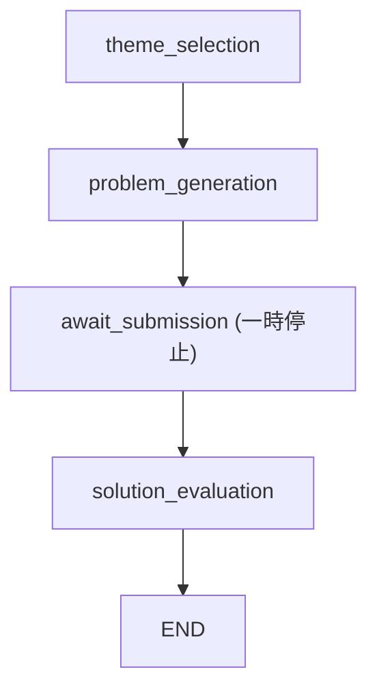

# Competitive

## 目的

`competitive` は、アルゴリズムテーマごとに 1 問出題し、ユーザーのコード提出を採点する機能です。  
通常 quiz より単純で、1 セッションは 1 回の出題と 1 回の提出を中心に進みます。

## API の責務

| API | 役割 |
| --- | --- |
| `GET /algorithm-quiz/themes` | テーマ一覧 |
| `GET /algorithm-quiz/sessions` | 最近のセッション一覧 |
| `POST /algorithm-quiz/sessions` | セッション開始 |
| `POST /algorithm-quiz/sessions/{session_id}/answer` | コード提出と採点 |
| `GET /algorithm-quiz/sessions/{session_id}` | セッション詳細取得 |

## API 契約

### `GET /algorithm-quiz/themes`

- 役割
  - 選択可能なアルゴリズムテーマ一覧を返す
- 主要出力
  - `themes`
- 主な失敗
  - `503`
    - テーマ供給元が利用不可

### `GET /algorithm-quiz/sessions`

- 役割
  - 最近のセッション一覧を返す
- 主要出力
  - `sessions`
  - 各 item には `session_id`, `theme_id`, `status`, `created_at` が含まれる
  - 完了済みなら `score` も含まれる

### `POST /algorithm-quiz/sessions`

- 役割
  - 競プロクイズの session を開始する
- 主要入力
  - `theme_id`
    - 省略時は学習順ロジックで次テーマを選ぶ
- 主要出力
  - `session_id`
  - 問題文、入出力形式、制約、例
- 主な失敗
  - `422`
    - テーマ指定や開始条件が不正
  - `503`
    - 競プロクイズ機能が利用不可

### `POST /algorithm-quiz/sessions/{session_id}/answer`

- 役割
  - コードを提出し、採点結果を返す
- 主要入力
  - `user_code`
- 主要出力
  - `session_id`
  - `score`
  - `feedback`
  - `time_complexity`
  - `space_complexity`
  - `improvement_suggestions`
- 主な失敗
  - `404`
    - session が見つからない
  - `409`
    - すでに回答済み
  - `422`
    - 提出内容が不正
  - `503`
    - 一過性 LLM エラー

### `GET /algorithm-quiz/sessions/{session_id}`

- 役割
  - session の保存済み内容を返す
- 主要出力
  - 問題文、入出力形式、制約、例
  - 完了済みなら採点結果
- 重要な制約
  - `reference_solution`
  - `grading_rubric`
  - これらは返さない
- 主な失敗
  - `404`
    - session が見つからない

## フローの仕様

### 開始条件

- `POST /algorithm-quiz/sessions`
- `theme_id` 指定があればそのテーマを使う
- 未指定なら学習順ロジックで次のテーマを選ぶ

### ノード一覧

| node | 責務 | 読む状態 | 書く状態 | 次の遷移 |
| --- | --- | --- | --- | --- |
| `theme_selection` | 対象テーマを決める | 任意の `theme_id` | `algo_theme_*`, `status` | `problem_generation` |
| `problem_generation` | 問題文と採点素材を作る | テーマ情報 | `problem_statement`, `examples`, `reference_solution`, `grading_rubric` など | `await_submission` |
| `await_submission` | コード提出待ちの一時停止点 | 公開可能な状態 | `user_code` | `solution_evaluation` |
| `solution_evaluation` | コード採点 | 問題文, rubric, user code | `score`, `feedback`, 複雑度, 改善提案 | END |

## 主要な状態

| 状態キー | 意味 |
| --- | --- |
| `algo_theme_id`, `algo_theme_label`, `algo_theme_category` | 選択テーマ |
| `programming_language` | 出題言語 |
| `problem_statement`, `input_format`, `output_format`, `constraints`, `examples` | ユーザーに見せる問題情報 |
| `reference_solution`, `grading_rubric` | 採点用の非公開素材 |
| `user_code` | 提出コード |
| `score`, `feedback`, `time_complexity`, `space_complexity`, `improvement_suggestions` | 採点結果 |

## 公開する状態と非公開の状態

この機能で特に重要なのは、LangGraph の状態全体をそのまま外に出さないことです。

- 外部へ返してよいもの
  - 問題文
  - 入出力形式
  - 制約
  - 例
  - 採点結果
- 外部へ返してはいけないもの
  - `reference_solution`
  - `grading_rubric`

`GET /algorithm-quiz/sessions/{id}` もこの 2 つは隠します。  
`await_submission` の一時停止でも、再開時の入力は `user_code` しか受け付けません。

## 一時停止と再開の約束事

- 一時停止点は `await_submission` のみ
- 再開時の必須キーは `user_code`
- `user_code` 以外のキーを含む入力は reject する

このルールは、採点素材の上書き防止が目的です。  
再開時の入力の拡張は慎重に扱うべきです。

## 永続化境界

- DB に残るもの
  - session metadata
  - 問題文
  - 採点に必要な非公開素材
  - 最終回答と採点結果
- プロセス内にしか残らないもの
  - 一時停止中の LangGraph チェックポイント

セッション開始直後に、LangGraph の主要成果物は SQLite に保存されます。  
そのため、後から `GET /algorithm-quiz/sessions/{id}` で問題情報を再取得できます。

## 失敗時の扱い

- テーマ取得不能や実行器不可用は `503`
- 不正入力は `422`
- 存在しない session は `404`
- 二重提出は `409`
- 一過性 LLM エラーは `503`

## docs を更新すべき変更

- 再開時入力の許可キー変更
- 非公開状態の境界変更
- ノード構成の変更
- セッション保存タイミングの変更
