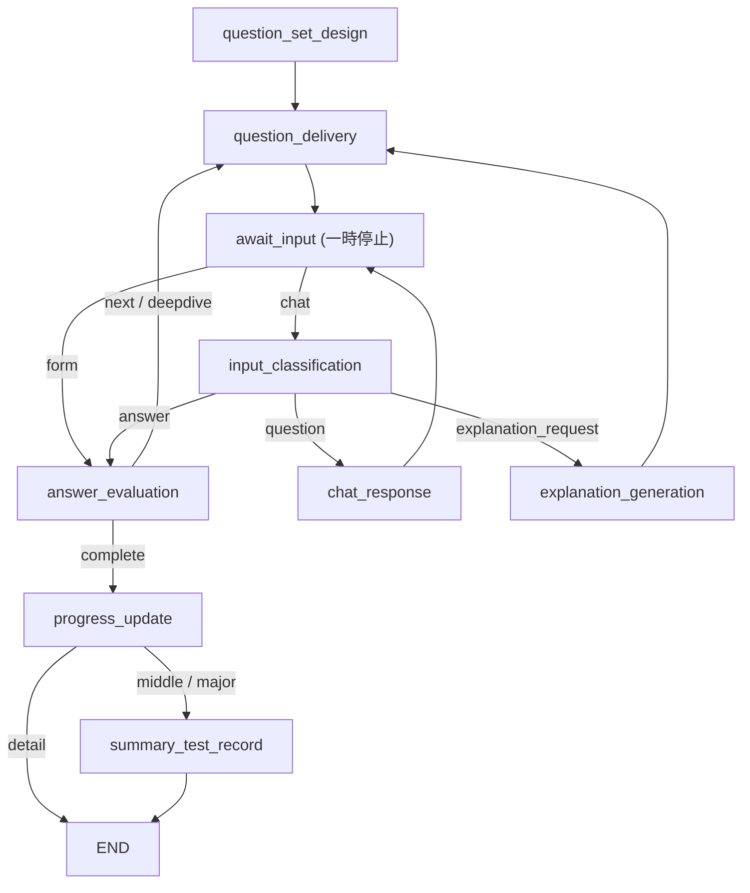
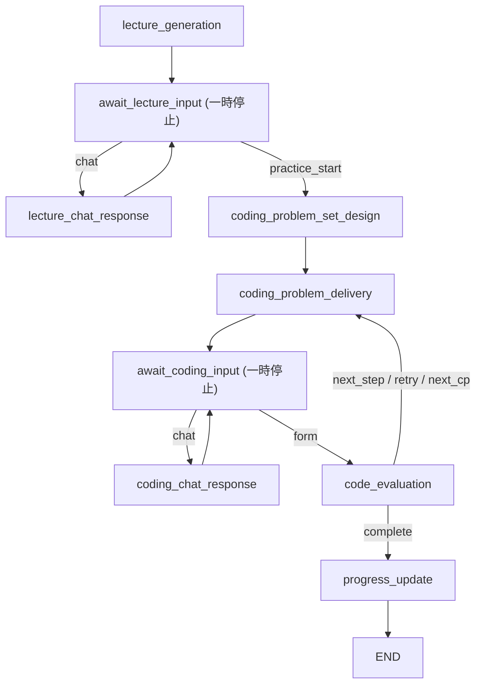

# Quiz

## 目的

`quiz` は 1 つの roadmap item を学習単位として、対話的に理解確認を進める機能です。  
現在は次の 2 系統を持ちます。

- 通常クイズ
  - 確認ポイントを作り、設問、回答評価、補足説明を繰り返す
- coding session
  - 座学フェーズのあと、段階的なコーディング課題に進む

## API の責務

| API | 役割 |
| --- | --- |
| `POST /sessions` | 通常クイズの開始。既存の in-progress セッションがあれば再開を促す |
| `POST /sessions/{session_id}/input` | 通常クイズまたは coding session を再開する |
| `GET /sessions/{session_id}` | DB 上の session と、存在すれば LangGraph の現在状態を返す |
| `POST /sessions/coding` | coding session の開始 |
| `POST /sessions/{session_id}/practice/start` | 座学フェーズから練習フェーズへ遷移 |

router 自体は薄く、処理の中心は `session_lifecycle` と LangGraph 実行器にあります。

## API 契約

### `POST /sessions`

- 役割
  - roadmap item に対する通常クイズを開始する
  - すでに同じ item の in-progress session があれば、新規作成せず再開を促す
- 主要入力
  - `roadmap_item_id`
- 主要出力
  - `session_id`
  - `resume_required`
  - `resume_session_id`
- 主な失敗
  - `422`
    - roadmap item が不正
    - session 開始条件を満たさない
  - `503`
    - quiz 機能が利用不可

### `POST /sessions/{session_id}/input`

- 役割
  - 一時停止中の通常クイズまたは coding session を再開する
- 主要入力
  - `user_input`
  - `input_source`
    - `form`
    - `chat`
- 主要出力
  - 再開後の最新状態
  - 通常クイズと coding session では返る状態項目が一部異なる
- 主な失敗
  - `422`
    - 入力形式が不正
    - session が期待する再開入力と合わない
  - `503`
    - 一過性 LLM エラー
    - quiz / coding session 機能が利用不可

### `GET /sessions/{session_id}`

- 役割
  - DB 上の session 情報と、存在すれば LangGraph の現在状態を返す
- 主要出力
  - `session_id`
  - `session`
  - `graph_state`
- 主な失敗
  - `404`
    - DB 上の session も LangGraph の現在状態も見つからない

### `POST /sessions/coding`

- 役割
  - coding session を開始する
- 主要入力
  - `roadmap_item_id`
- 主要出力
  - `session_id`
  - `lecture_content`
  - `lecture_phase_active`
- 主な失敗
  - `404`
    - roadmap item が見つからない
  - `422`
    - 初期化入力が不正
  - `503`
    - coding session 機能が利用不可

### `POST /sessions/{session_id}/practice/start`

- 役割
  - coding session の座学フェーズから練習フェーズへ進める
- 主要出力
  - `session_id`
  - `confirmation_points`
  - `current_question_text`
  - `current_example_code`
  - `current_format`
  - `current_point_index`
  - `total_questions_asked`
- 主な失敗
  - `422`
    - session が期待する状態にない
  - `503`
    - coding session 機能が利用不可

## 通常クイズの振る舞い

### セッションのライフサイクル

1. `POST /sessions` で roadmap item を指定する
2. 同じ item に in-progress セッションがあれば新規作成せず、その session id を返す
3. 新規作成時は SQLite に session を保存してから LangGraph を開始する
4. フローは `question_set_design` から始まり、最初の `await_input` で一時停止する
5. `POST /sessions/{id}/input` で再開し、回答・質問・説明要求を処理する
6. `next_action == complete` に到達すると進捗を更新し、必要なら summary test を記録する

### 状態機械

### フローの仕様

| node | 責務 | 読む状態 | 書く状態 | 次の遷移 |
| --- | --- | --- | --- | --- |
| `question_set_design` | 確認ポイント集合を作る | roadmap item 情報 | `confirmation_points`, `current_point_index`, `topic_overview` | `question_delivery` |
| `question_delivery` | 現在の確認ポイントに対する設問を作る | `confirmation_points`, `current_point_index` | `current_question_text`, `current_answer_type`, `total_questions_asked` | `await_input` |
| `await_input` | ユーザー入力待ちの一時停止点 | 全体状態 | `user_input`, `input_source` | form または chat に応じて分岐 |
| `input_classification` | chat 入力の意図判定 | `user_input` | `input_type` | answer / question / explanation_request |
| `chat_response` | 質問への応答 | `user_input`, `current_question_text` | `chat_response_text` | `await_input` |
| `answer_evaluation` | 回答評価 | `user_input`, `current_question_text`, `current_point_index` | `answers`, `next_action`, `input_type` | next / deepdive / complete |
| `explanation_generation` | 補足説明 | `current_question_text`, 現在の確認ポイント | `explanation_text` | `question_delivery` |
| `progress_update` | roadmap 側の進捗反映 | `answers`, `roadmap_item_id` | 永続化中心 | detail なら END、middle/major なら summary test |
| `summary_test_record` | 上位レベルのサマリ結果保存 | `answers`, `roadmap_item_level` | 永続化中心 | END |

### 主要な状態

通常クイズで保守上重要なのは以下です。

| 状態キー | 意味 |
| --- | --- |
| `confirmation_points` | 学習対象の確認ポイント列 |
| `current_point_index` | 次に消化すべき確認ポイント位置 |
| `current_question_text` | 現在ユーザーが答える設問 |
| `current_answer_type` | `textarea` または `code` |
| `input_source` | `form` または `chat` |
| `input_type` | `answer`, `question`, `explanation_request` |
| `next_action` | `next`, `deepdive`, `complete` |
| `answers` | 追記だけされる回答履歴 |
| `total_questions_asked` | 出題総数。20問収束ルールに関わる |

### 一時停止と再開の約束事

- 一時停止点は `await_input` のみ
- 再開時の入力は `user_input` と `input_source` を中心に扱う
- `form` 入力は最終的に `input_type="answer"` に正規化される
- `chat` 入力は `input_classification` を通って意図別に分岐する

### どこまで保存されるか

- DB に残るもの
  - `quiz_sessions`
  - `quiz_answers`
  - 進捗更新結果
  - summary test 結果
- プロセス内にしか残らないもの
  - LangGraph の一時停止チェックポイント
  - `current_question_text` などの途中状態

再開の土台になる履歴は `QuizAnswer` にあります。  
一方で、その場の一時停止と再開は `MemorySaver` を使うため、プロセス再起動をまたぐ途中状態の復元は保証されません。  
背景は [ADR-005](/Users/tsuryoryo/Desktop/repo/obsidian/docs/adr/005-session-resume-from-history.md) を参照してください。

### 失敗時の扱い

- フロー開始に失敗した新規 session は後始末を試みる
- 一過性 LLM エラーは `TransientLlmNodeError` として扱い、HTTP では `503`
- `InvalidUpdateError` は「前回の一時停止がすでに消化されている」と見なして再試行に回す

## Coding Session の振る舞い

coding session は通常クイズとは別の処理フローを持ちます。

### 開始条件

- `POST /sessions/coding` で session id を払い出す
- roadmap item の title / description / level を初期状態に入れる
- フローは `lecture_generation` から始まる

### 主要な状態

| 状態キー | 意味 |
| --- | --- |
| `lecture_content` | 座学フェーズで表示する説明 |
| `lecture_phase_active` | 座学中かどうか |
| `confirmation_points` | コーディング課題の確認ポイント |
| `current_question_text` | 現在の課題文 |
| `current_example_code` | 補助コード例 |
| `current_format` | `rewrite`, `fill_blank`, `bug_fix`, `extend`, `implement` |
| `coding_attempts` | 提出履歴 |
| `current_score`, `current_feedback` | 最新評価結果 |
| `next_action` | `next_step`, `retry`, `next_cp`, `complete` |

### 一時停止と再開の約束事

- `await_lecture_input`
  - 許可キーは `user_input`, `input_source`, `lecture_phase_active`
  - `lecture_phase_active=False` にすると練習フェーズへ進む
- `await_coding_input`
  - 許可キーは `user_input`, `input_source`
  - `input_source` は `form` または `chat`

### docs を更新すべき変更

- node の追加/削除
- 分岐条件の変更
- 再開時入力の許可キー変更
- DB に保存する境界の変更

プロンプト文面やノード内部の補助関数変更だけなら、この doc は通常更新不要です。
